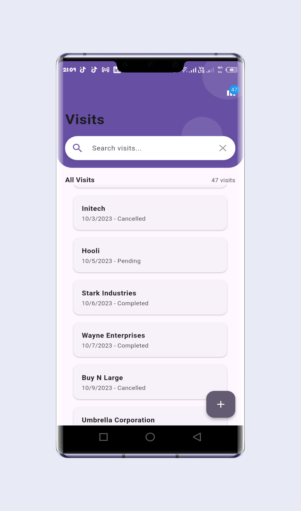
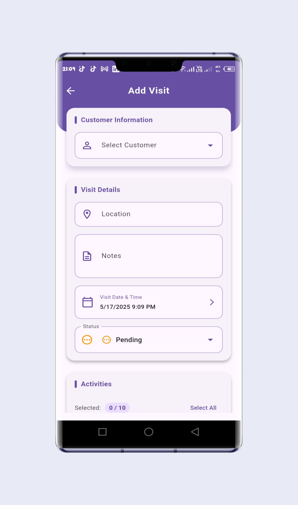
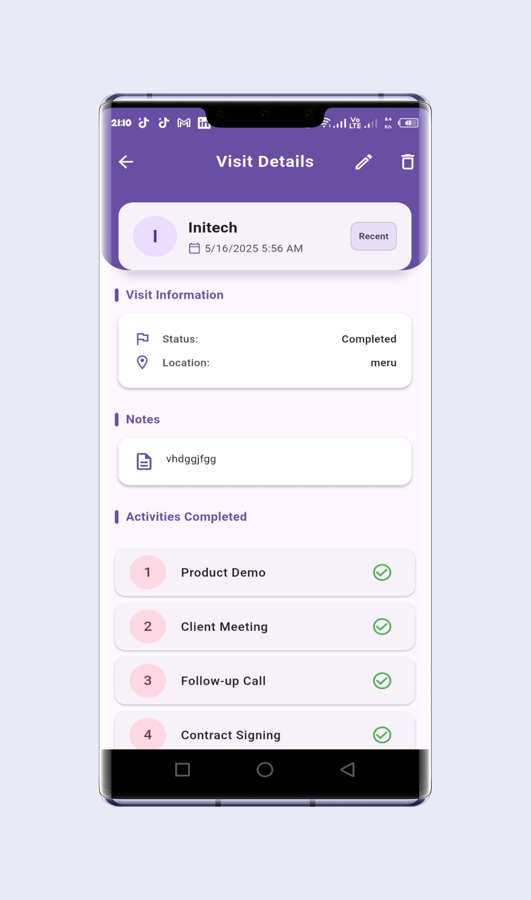
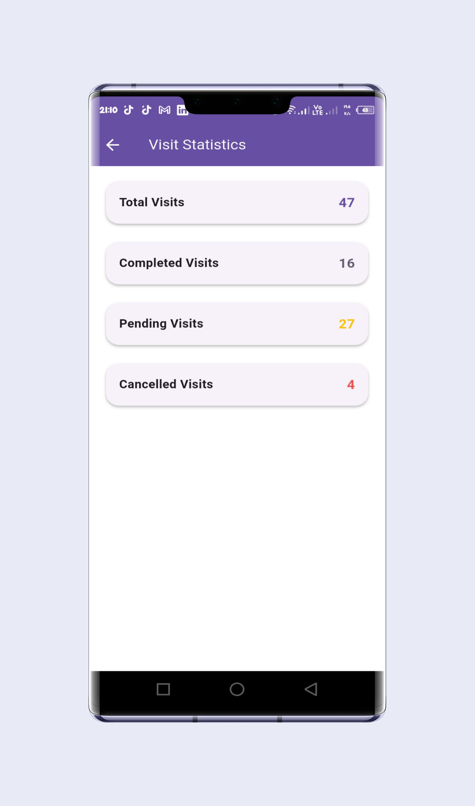

# RTM Visit Tracker

## Overview

RTM Visit Tracker is a Flutter-based feature for Route-to-Market (RTM) Sales Force Automation, crafted to empower sales representatives to manage customer visits with ease and efficiency. Built for the Flutter Mobile Engineer Technical Challenge, this production-quality mobile application delivers a robust, user-friendly experience, allowing users to:

- Add new customer visits through intuitive, validated forms
- View, search, and filter a list of customer visits
- Track activities completed during visits
- Access basic visit statistics with visual insights
- Operate offline, with seamless data synchronization when connectivity is restored

The app integrates with a Supabase backend via REST APIs, leverages the BLoC pattern for state management, and uses Hive for local storage, all structured around clean architecture principles. This ensures scalability, maintainability, and a foundation for future growth, making it a solid component of a larger RTM system.

## Screenshots

* **Visit List Screen**: Displays all visits with search and filter capabilities.
* **Visit Form Screen**: Enables adding/editing visits with form validation.
* **Visit Details Screen**: Presents detailed visit information.
* **Statistics Screen**: Visualizes visit statistics with charts.

<table>
  <tr>
    <td></td>
    <td></td>
    <td></td>
    <td></td>
  </tr>
  <tr>
    <td align="center"><b>Visit List</b></td>
    <td align="center"><b>Visit Form</b></td>
    <td align="center"><b>Visit Details</b></td>
    <td align="center"><b>Statistics</b></td>
  </tr>
</table>

## Installation

### Direct APK Installation
You can install the app directly by downloading the release APK:

1. Download the APK from the [Releases](https://github.com/joelwanjohi/RTM-Visit-Tracker/releases) section of this repository
2. On your Android device, enable installation from unknown sources in settings
3. Open the downloaded APK file to install the application

Note: If the release is not yet available, you can build it yourself using `flutter build apk --release` and find the APK at `build/app/outputs/apk/release/app-release.apk`

## Project Structure

The project follows a clean architecture-inspired folder structure, promoting modularity, testability, and ease of maintenance. Below is the organization of key directories and files:

```
rtm_visit_tracker/
├── lib/
│   ├── core/                           # Core utilities and cross-cutting concerns
│   │   ├── di/                        # Dependency injection setup
│   │   │   └── injection.dart
│   │   ├── error/                     # Error handling and failure models
│   │   │   └── failures.dart
│   │   ├── network/                   # HTTP client and API configurations
│   │   │   └── dio_client.dart
│   │   └── theme/                     # App theming and styling
│   │       └── app_theme.dart
│   ├── features/                      # Feature-specific modules
│   │   ├── activities/                # Activities feature
│   │   │   ├── data/                  # Data layer (models, repositories, data sources)
│   │   │   │   ├── datasources/
│   │   │   │   │   ├── activity_local_data_source.dart
│   │   │   │   │   └── activity_remote_data_source.dart
│   │   │   │   ├── models/
│   │   │   │   │   └── activity_model.dart
│   │   │   │   └── repositories/
│   │   │   │       └── activity_repository_impl.dart
│   │   │   ├── domain/                # Domain layer (entities, use cases, repositories)
│   │   │   │   ├── entities/
│   │   │   │   │   └── activity.dart
│   │   │   │   ├── repositories/
│   │   │   │   │   └── activity_repository.dart
│   │   │   │   └── usecases/
│   │   │   │       └── get_activities.dart
│   │   │   └── presentation/          # Presentation layer (BLoC, UI)
│   │   │       ├── bloc/
│   │   │       │   ├── activity_bloc.dart
│   │   │       │   ├── activity_event.dart
│   │   │       │   └── activity_state.dart
│   │   ├── customers/                 # Customers feature (similar structure)
│   │   ├── visits/                    # Visits feature (similar structure)
│   │   │   ├── data/
│   │   │   │   ├── datasources/
│   │   │   │   │   ├── visit_local_data_source.dart
│   │   │   │   │   └── visit_remote_data_source.dart
│   │   │   │   ├── models/
│   │   │   │   │   └── visit_model.dart
│   │   │   │   └── repositories/
│   │   │   │       └── visit_repository_impl.dart
│   │   │   ├── domain/
│   │   │   │   ├── entities/
│   │   │   │   │   └── visit.dart
│   │   │   │   ├── repositories/
│   │   │   │   │   └── visit_repository.dart
│   │   │   │   └── usecases/
│   │   │   │       ├── add_visit.dart
│   │   │   │       ├── get_visits.dart
│   │   │   │       └── update_visit.dart
│   │   │   └── presentation/
│   │   │       ├── bloc/
│   │   │       │   ├── visit_bloc.dart
│   │   │       │   ├── visit_event.dart
│   │   │       │   └── visit_state.dart
│   │   │       ├── screens/
│   │   │       │   ├── visit_list_screen.dart
│   │   │       │   ├── visit_form_screen.dart
│   │   │       │   └── visit_details_screen.dart
│   │   │       └── widgets/
│   │   │           └── visit_card.dart
│   │   ├── statistics/                # Statistics feature (similar structure)
│   │   │   └── presentation/
│   │   │       ├── bloc/
│   │   │       │   ├── statistics_bloc.dart
│   │   │       │   ├── statistics_event.dart
│   │   │       │   └── statistics_state.dart
│   │   │       └── screens/
│   │   │           └── statistics_screen.dart
│   ├── main.dart                      # App entry point and navigation setup
├── test/                              # Unit and widget tests
│   ├── unit/
│   │   ├── activity_repository_test.dart
│   │   ├── customer_repository_test.dart
│   │   ├── visit_repository_test.dart
│   │   └── statistics_repository_test.dart
│   ├── widget/
│   │   ├── visit_list_screen_test.dart
│   │   └── visit_form_screen_test.dart
├── .env                               # Environment variables (Supabase credentials)
├── pubspec.yaml                       # Dependencies and assets
├── screenshots/                       # Screenshots for README
└── .github/workflows/flutter.yml      # CI/CD pipeline
```

This structure ensures each feature is self-contained, with clear separation of concerns across layers, making it easy to extend or maintain.

## Setup Instructions

To run the RTM Visit Tracker locally, follow these steps:

### Prerequisites

- Flutter SDK: 3.29.3
- Dart: 3.5.3
- Android Studio or VS Code with Flutter plugins
- Git

### Installation

1. **Clone the Repository:**
   ```bash
   git clone https://github.com/joelwanjohi/RTM-Visit-Tracker.git
   cd RTM-Visit-Tracker
   ```

2. **Install Dependencies:**
   ```bash
   flutter pub get
   ```

3. **Configure Environment:**
   Create a `.env` file in the project root:
   ```
   SUPABASE_URL=your-supabase project-url
   SUPABASE_ANON_KEY=your-anon-key
   API_URL=your-api-url

   ```

4. **Generate Code:**
   ```bash
   dart run build_runner build --delete-conflicting-outputs
   ```

5. **Run the App:**
   ```bash
   flutter run
   ```

6. **Run Tests:**
   ```bash
   flutter test
   ```

## Technical Implementation

### Offline Support

- Hive persists visits, customers, and activities locally, enabling offline CRUD operations
- A synchronization service queues offline changes and syncs with Supabase when online, monitored via connectivity_plus
- Conflict resolution uses the latest updated_at timestamp to prioritize updates

### Testing

- **Unit Tests:** Validate repositories (VisitRepository, CustomerRepository, ActivityRepository) and BLoCs using mockito for mocked data sources
- **Widget Tests:** Ensure correct UI rendering and state transitions for VisitListScreen and VisitFormScreen
- Execute all tests with flutter test

### CI/CD

A GitHub Actions pipeline, defined in .github/workflows/flutter.yml, automates quality checks and build processes to ensure code reliability. The pipeline is triggered on pushes and pull requests to the main branch and includes the following steps:

- Checkout Code: Clones the repository using actions/checkout@v4
- Setup Java: Configures Java 17 (Temurin distribution) for Android builds using actions/setup-java@v4
- Setup Flutter: Installs Flutter 3.29.3 (stable channel) with caching for faster runs using subosito/flutter-action@v2
- Install Dependencies: Runs flutter pub get to fetch dependencies
- Static Analysis: Executes flutter analyze --no-fatal-infos to enforce code quality
- Run Tests: Performs unit and widget tests with flutter test
- Build APK: Generates a debug APK (flutter build apk --debug) for verification
- Upload Artifact: Stores the APK (app-debug.apk) as an artifact for 7 days using actions/upload-artifact@v4

Artifacts are available in the GitHub Actions UI for each successful run, facilitating build verification.
View pipeline status at [GitHub Actions](https://github.com/joelwanjohi/RTM-Visit-Tracker/actions).

## Assumptions, Trade-offs, and Limitations

### Assumptions

- Supabase API endpoints (/customers, /visits, /activities) remain stable
- Devices have sufficient storage for Hive caching
- Basic visit statistics (e.g., completed visit counts) suffice, with room for advanced analytics later

### Trade-offs

- Emphasized clean architecture for maintainability over rapid prototyping, increasing initial development time
- Chose Dio over http for HTTP requests to leverage interceptors, accepting a slightly larger dependency size
- Implemented timestamp-based conflict resolution for offline sync due to time constraints, deferring complex strategies like user-driven merges

### Limitations

- The CI/CD pipeline faced issues with identifying generated Hive files (e.g., activity_model.g.dart, customer_model.g.dart, visit_model.g.dart), requiring manual dart run build_runner build before analysis. This suggests a dependency resolution challenge in the automated workflow, which can be resolved in future iterations
- Advanced search/filter features (e.g., fuzzy search) are basic to meet the deadline but are extensible
- Offline sync assumes eventual connectivity; extended offline periods may delay data consistency
- UI enhancements (e.g., animations) are minimal to prioritize core functionality and architecture

## Contributing

Contributions are welcome! Please feel free to submit a Pull Request.

## License

This project is licensed under the MIT License - see the [LICENSE](LICENSE) file for details.

## Contact

Joel Wanjohi - [joelwanjohi207@gmail.com](mailto:joelwanjohi207@gmail.com)


Project Link: [https://github.com/joelwanjohi/RTM-Visit-Tracker](https://github.com/joelwanjohi/RTM-Visit-Tracker)
